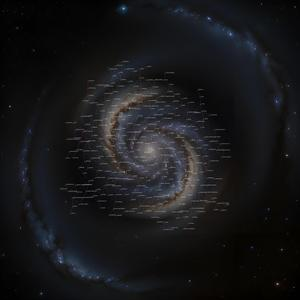
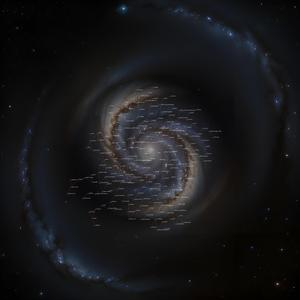
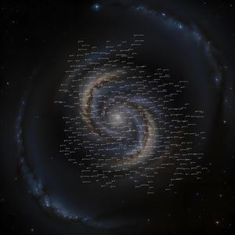

### Welcome to the Endless Sky Galaxy Generator! 
 
This repo generates plugins, containing a new galaxy generated out of the following options:
<ul>
  <li>the center position of the new galaxy</li>
  <li>amount of systems (between 1 and 500)</li>
  <li>amount of landable planets (between 0 and 500)</li>
  <li>amount of races (between 0 and 12)</li>
  <li>a vanilla system for the wormhole link (choose the name)</li>
  <li>number of suns a system can have</li>
  <li>number of non-landable planets a system can have</li>
  <li>number of minables a system can have</li>
  <li>the background galaxy image (4 to choose )</li>
  <li>radius around a star at which new systems get generated</li>
  <li>density of systems/dead arms</li>
  <li>re-tries of system generation to influence galaxy core density</li>
</ul>
Other used features are:
<ul>
  <li>each race is made of a capital planet, neighbouring colony planets, 4 galactica ships and distributed fleets</li>
  <li>cleaned up wordlists (system names, planet names, landing images, planet images, star images)</li>
  <li>zip creation with correct folder structure (ready to play plugin)</li>
</ul>
 
To generate such a galaxy, open an issue and choose the galaxy generation template, modify the values inside the issue form, and post the issue. Between 30 seconds and 1 minute later, this readme shows the new generated galaxy, the generated files, a map of the galaxy, and a link to a zip with the complete plugin data. 
 
The generated plugins don't offer much play-worthy content, but is a great start for your own plugin creation. So feel free to modify and play around with it. 
 
Why is it not working? In case you change the values beyond max and min values the script stops before generating fatal errors, so try to stay within the mentioned min max. You can always check the actions tab to see at which point the generation stopped and why. 
 
Have fun! 
 
 
latest 5 generated galaxies: 
<table>
  <tr>
    <td width=200>
      name: Obsidian 
       
      pos: (3000, 2000) 
      systems: 50 
      planets: 100 
      races: 3 
      wormhole: Sol 
      sunmax: 3 
      planetmax: 5 
      minablemax: 50 
      image: sculptor 
      starradius: 100 
      density: 7 
      tries: 15 
    </td>
    <td width=200>
      plugin: <a href="https://github.com/zuckung/ES-GalaxyGenerator/releases/download/Latest/Obsidian0.zip">Obsidian0.zip</a> 
       
       
      <a href="generated/Obsidian0/MapGenSystems.txt">MapGenSystems.txt</a> 
      <a href="generated/Obsidian0/MapGenPlanets.txt">MapGenPlanets.txt</a> 
      <a href="generated/Obsidian0/MapGenStuff.txt">MapGenStuff.txt</a> 
    </td>
    <td width=300>
      
    </td>
  </tr>
</table>

<table>
  <tr>
    <td width=200>
      name: Tester 
       
      pos: (-10000, -10000) 
      systems: 300 
      planets: 100 
      races: 6 
      wormhole: Sol 
      sunmax: 3 
      planetmax: 5 
      minablemax: 3 
      image: messier 
      starradius: 100 
      density: 5 
      tries: 15 
    </td>
    <td width=200>
      plugin: <a href="https://github.com/zuckung/ES-GalaxyGenerator/releases/download/Latest/Tester1.zip">Tester1.zip</a> 
       
       
      <a href="generated/Tester1/MapGenSystems.txt">MapGenSystems.txt</a> 
      <a href="generated/Tester1/MapGenPlanets.txt">MapGenPlanets.txt</a> 
      <a href="generated/Tester1/MapGenStuff.txt">MapGenStuff.txt</a> 
    </td>
    <td width=300>
      
    </td>
  </tr>
</table>

<table>
  <tr>
    <td width=200>
      name: zuckung 
       
      pos: (-5000, 5000) 
      systems: 200 
      planets: 10 
      races: 12 
      wormhole: Sol 
      sunmax: 2 
      planetmax: 3 
      minablemax: 2 
      image: messier 
      starradius: 100 
      density: 5 
      tries: 15 
    </td>
    <td width=200>
      plugin: <a href="https://github.com/zuckung/ES-GalaxyGenerator/releases/download/Latest/zuckung4.zip">zuckung4.zip</a> 
       
       
      <a href="generated/zuckung4/MapGenSystems.txt">MapGenSystems.txt</a> 
      <a href="generated/zuckung4/MapGenPlanets.txt">MapGenPlanets.txt</a> 
      <a href="generated/zuckung4/MapGenStuff.txt">MapGenStuff.txt</a> 
    </td>
    <td width=300>
      
    </td>
  </tr>
</table>

<table>
  <tr>
    <td width=200>
      name: zuckung 
       
      pos: (-10000, -10000) 
      systems: 200 
      planets: 50 
      races: 6 
      wormhole: Sol 
      sunmax: 3 
      planetmax: 5 
      minablemax: 3 
      image: sculptor 
      starradius: 100 
      density: 5 
      tries: 15 
    </td>
    <td width=200>
      plugin: <a href="https://github.com/zuckung/ES-GalaxyGenerator/releases/download/Latest/zuckung1.zip">zuckung1.zip</a> 
       
       
      <a href="generated/zuckung1/MapGenSystems.txt">MapGenSystems.txt</a> 
      <a href="generated/zuckung1/MapGenPlanets.txt">MapGenPlanets.txt</a> 
      <a href="generated/zuckung1/MapGenStuff.txt">MapGenStuff.txt</a> 
    </td>
    <td width=300>
      
    </td>
  </tr>
</table>

<table>
  <tr>
    <td width=200>
      name: zuckung 
       
      pos: (10000, 10000) 
      systems: 100 
      planets: 50 
      races: 0 
      wormhole: Sol 
      sunmax: 3 
      planetmax: 5 
      minablemax: 3 
      image: carina 
      starradius: 100 
      density: 5 
      tries: 15 
    </td>
    <td width=200>
      plugin: <a href="https://github.com/zuckung/ES-GalaxyGenerator/releases/download/Latest/zuckung3.zip">zuckung3.zip</a> 
       
       
      <a href="generated/zuckung3/MapGenSystems.txt">MapGenSystems.txt</a> 
      <a href="generated/zuckung3/MapGenPlanets.txt">MapGenPlanets.txt</a> 
      <a href="generated/zuckung3/MapGenStuff.txt">MapGenStuff.txt</a> 
    </td>
    <td width=300>
      
    </td>
  </tr>
</table>

